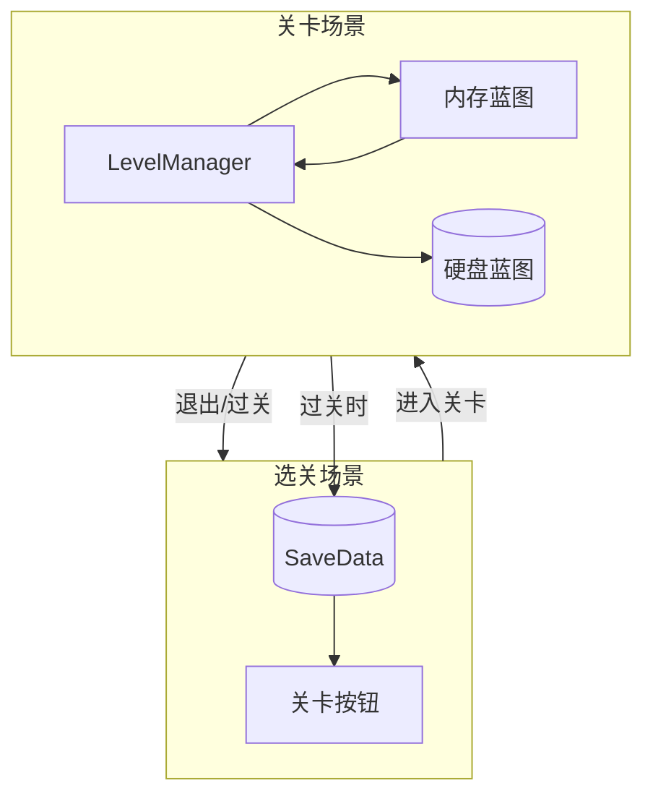
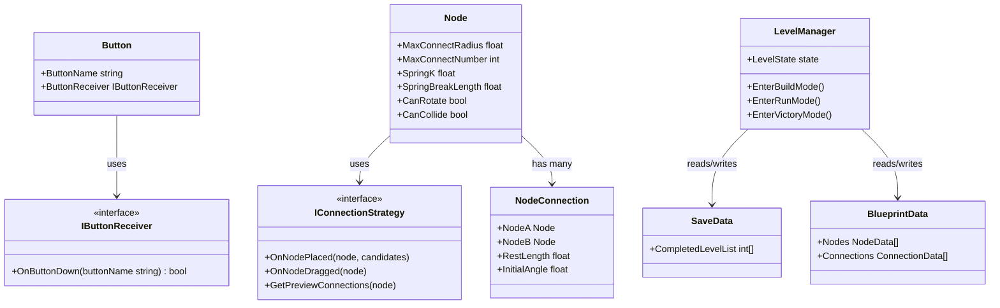
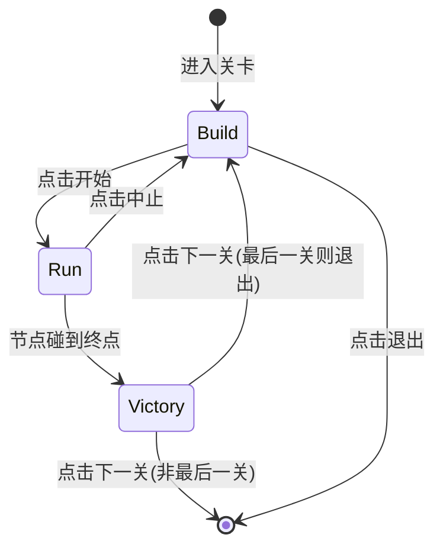
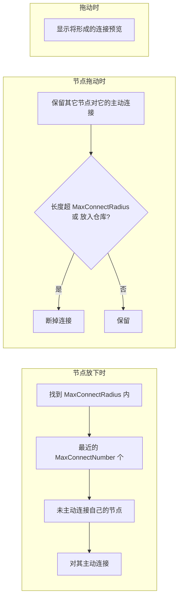

# 代码架构

本文档基于 [思路.md](思路.md) 中的游戏设计，将设计思路转化为可执行的代码架构说明。

## 1. 项目概述

| 维度 | 说明 |
|------|------|
| **游戏类型** | 捣蛋猪式载具建造 + 粘粘世界式节点连接 |
| **技术栈** | Unity 3D URP 渲染 + 2D 物理（Rigidbody2D、Collider2D） |
| **核心原则** | 游戏逻辑与渲染/UI 分离，逻辑放在独立目录 |

## 2. 目录结构

```
Assets/
├── Scripts/
│   ├── GameLogic/           # 游戏逻辑（独立目录，与渲染/UI 解耦）
│   │   ├── Core/            # 核心抽象（IButtonReceiver、常量等）
│   │   ├── Nodes/           # 节点与连接
│   │   ├── Physics/         # 弹簧、力矩等物理计算
│   │   ├── Save/            # 存档
│   │   └── Level/           # 关卡状态机
│   ├── Rendering/           # 渲染相关（URP、材质、形状）
│   └── UI/                  # UI 组件与界面
├── Scenes/                  # 选关场景 + 各关卡场景
└── Documents/               # 思路.md、代码架构.md
```

## 3. 核心模块设计

| 模块 | 职责 | 关键类/接口 |
|------|------|-------------|
| **UI 抽象** | 按钮与接收者解耦 | `Button`, `IButtonReceiver` |
| **节点系统** | 节点类型、连接逻辑、物理 | `Node`, `NodeConnection`, `IConnectionStrategy` |
| **物理** | 弹簧、阻尼、断裂、力矩 | `SpringForce`, `AngularSpring` |
| **存档** | 蓝图、通关列表 | `SaveData`, `BlueprintData` |
| **关卡** | 建造/运行/过关状态 | `LevelState`, `LevelManager` |
| **相机** | 质心跟随、动态缩放 | `RuntimeCameraController` |

## 4. 关键类与接口

### 4.1 UI 抽象

**IButtonReceiver**：

```csharp
public interface IButtonReceiver {
    bool OnButtonDown(string buttonName);
}
```

**Button**：公共字段 `ButtonName`, `ButtonReceiver`，点击时调用 `ButtonReceiver.OnButtonDown(ButtonName)`。

### 4.2 节点系统

**Node**：基类，子类实现不同节点类型。

- `MaxConnectRadius`：主动连接最大半径
- `MaxConnectNumber = 3`：主动连接最大数量
- `SpringK`：弹性系数（公共静态字段）
- `SpringBreakLength`：弹簧断裂长度（公共静态字段）
- `CanRotate`：是否参与旋转/力矩
- `CanCollide`：是否参与物理碰撞

**IConnectionStrategy**：抽象连接决策逻辑，便于后续调整。

```csharp
public interface IConnectionStrategy {
    void OnNodePlaced(Node node, IReadOnlyList<Node> candidates);
    void OnNodeDragged(Node node);
    IReadOnlyList<NodeConnection> GetPreviewConnections(Node node);
}
```

**NodeConnection**：表示两个节点之间的连接，建造阶段存储关系，运行阶段施加力。

### 4.3 物理

- **径向力**：弹簧力 + 正比于速度的阻尼
- **切向力**：由两端力矩决定，满足角动量守恒
- **角度记录**：会旋转的节点记录每个连接的初始角度和上一帧角度，用于角向弹簧计算

### 4.4 存档

**SaveData**：

- `CompletedLevelList`：已通过的关卡列表

**BlueprintData**：

- 节点列表（类型、位置、连接关系）
- 与当前关卡 ID 关联

## 5. 数据流与场景

### 5.1 选关场景

- UI 预置在 Scene 中
- 读取 `SaveData.CompletedLevelList` 决定按钮颜色（绿/蓝/灰）与可点击性
- 解锁数量 = `CompletedLevelList.Length + InitialUnlockedLevelNum`

### 5.2 关卡场景

- `LevelManager` 进入时生成 UI（左上退出、右下开始/中止/下一关）
- 管理建造 / 运行 / 过关三种状态切换
- 蓝图离开关卡时保存到内存 + 硬盘；进入建造模式时从内存加载

### 5.3 数据流图



## 6. 物理与渲染分工

| 层级 | 职责 | 不负责 |
|------|------|--------|
| **Scripts/GameLogic** | 纯数据与逻辑（节点位置、连接关系、弹簧力计算、状态机） | 不直接操作 Mesh/Sprite |
| **Scripts/Rendering** | 根据 GameLogic 数据驱动 Mesh/Sprite 显示 | 不参与决策 |
| **物理** | 使用 Unity 2D 物理（Rigidbody2D、Collider2D），弹簧/连接力在 `FixedUpdate` 中施加 | - |

## 7. 常量与配置

| 常量 | 值 | 说明 |
|------|-----|------|
| `TotalLevelNum` | 10 | 总关卡数 |
| `InitialUnlockedLevelNum` | 3 | 初始解锁关卡数 |
| `MaxConnectNumber` | 3 | 节点主动连接最大数量 |
| `MaxHorizontalSpan` | 0.4 | 运行时相机水平方向节点到中心最大屏幕占比 |
| `MaxVerticalSpan` | 0.4 | 运行时相机竖直方向节点到中心最大屏幕占比 |

建议集中到 `GameConstants` 静态类或 ScriptableObject。

## 8. 类图

### 8.1 核心类关系



### 8.2 关卡状态机



### 8.3 节点连接逻辑（建造阶段）



## 9. 与思路.md 的对应关系

| 思路.md 章节 | 架构对应 |
|-------------|----------|
| 实现框架 | Scripts/GameLogic 独立目录、Button/IButtonReceiver |
| 选关页面 | LevelSelect 场景、SaveData、关卡按钮状态 |
| 关卡内部 | LevelManager、三种状态、UI 动态生成 |
| 节点 | Node、NodeConnection、IConnectionStrategy |
| 节点如何决定连接 | IConnectionStrategy、OnNodePlaced/OnNodeDragged |
| 节点和连接的物理特性 | SpringForce、AngularSpring、角度累积逻辑 |
| 运行时相机 | RuntimeCameraController、质心跟随、动态缩放 |
